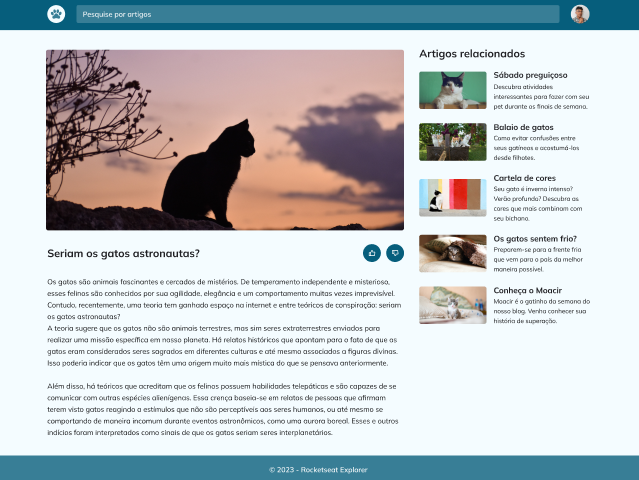

# 💻 About the project

Rocketseat Explorer - Stage 03 - Module 05 - Final Challenge - Create responsive website of a blog about cats, using animations, transitions and more.

## Application`s Layout

Project Figma is available on the link below:

https://www.figma.com/file/TtpExTx5lsl2oA8Zl0mII9/Blog-de-Gatos-%E2%80%A2-Desafio-Explorer-(Community)?node-id=0%3A1&mode=dev

## How to run the project?

To run this project, just download the repo on your machine and open index.html file on your browser.
